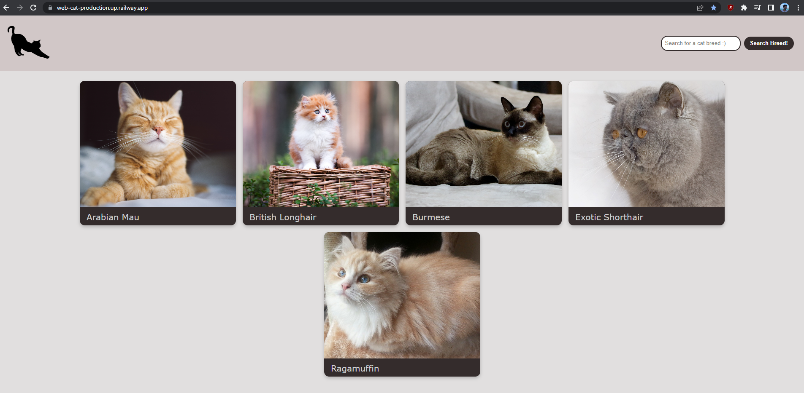

# web-cat application

This is the web-cat application designed as part of Hearst digital selection process.

## Architecture

The application was made using a simplified clean architecture, layers are divided in the folders as follow:

- configuration -> configurations that can/would be used by the entire application

- controller -> routes and view/page presentation 
- controller/converter -> converters between domain model and view model

- usecase -> business logic distributed in N files

- gateway -> any I/O used by the application is handled
- gateway/converter -> models from other sources are converted into domain models

- view -> pages/views are located

- public -> static provided files such as images,css,etc

## Technologies used

- node.js
- express
- pug
- docker
- redis

## Live application URL

https://web-cat-production.up.railway.app/


## Running it locally

````
docker compose -f docker-compose.debug.yml up
````

## CI/CD

This application is using Railway to run the live application, hosting both the website and redis.

In order to activate de CI/CD pipeline using GitHub Actions all that is needed is to push the commits to the main branch or merging a Pull Request in GitHub:

````
git push origin main
````